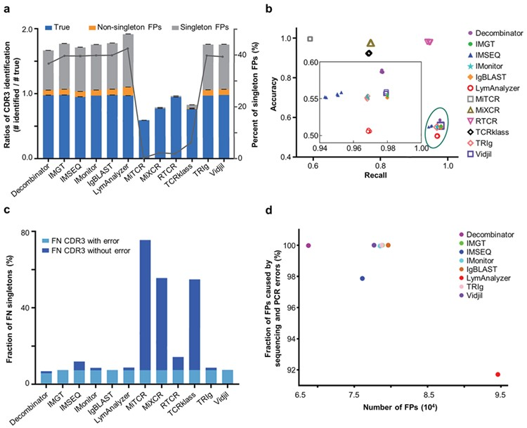

# Currently available tools for TCR-Seq data analysis

Maria S. Benítez-Cantos, Carlos Cano, Armando Blanco.

02-05-2020

***

Signals of past and present infections are encoded in the set of up to $10^{10}$  different T cell receptors (TCRs) that bind to antigens to trigger an immune response. TCR sequencing (TCR-Seq) techniques yield a complex dataset of reads with a region that can not be aligned against a reference genome, since it is *de novo* generated with random nucleotide addition and / or deletion that ensures a high variability necessary for antigen recognition. In this scenario sequencing errors difficult the data preprocessing and subsequent interpretation.  

## Main steps in TCR repertoire analyses

1. Library preparation and Sequencing
2. Sequence assembly
3. V(D)J and CDR3 assignment
4. Sequence abundance
5. Error correction
6. High level processing:
  - Frequency distribution
  - Diversity measurements
  - VJ usage
  - Sharing (public/private TCRs)
  - Antigen specificity

## Tools for TCR-Seq data analysis

Currently there are 11 tools for TCR-Seq analysis that perform steps 1-5. Below a table with information about these tools is shown:

| Tool name          | Publication                                                                    | Year | Citations (as of 14-05-2020) | Input format | Availability                           | Multi-thread support | Max. input size                   | In silico simulation as benchmark | Error correction method                        | Sequencing quality | UMIs | Clustering    | Frequency threshold | Performance in systematic comparison by Zhang et al. 2020  |
|--------------------|--------------------------------------------------------------------------------|------|------------------------------|--------------|----------------------------------------|----------------------|-----------------------------------|-----------------------------------|------------------------------------------------|--------------------|------|---------------|---------------------|------------------------------------------------------------|
| IMGT/HighV-QUEST   | [Link](https://hal.archives-ouvertes.fr/hal-00722909/)                                 | 2012 | 199                          | FASTA        | Online (account required)              | No                   | 150k                              | No                                | Sequence clustering (distance-based)           | No                 | No   | Yes           | No                  | High FP rate                                               |
| IgBLAST            | [Link](https://academic.oup.com/nar/article/41/W1/W34/1097536?login=true)              | 2013 | 685                          | FASTA        | Online/stand-alone (command line, C++) | Yes                  | <1k (online) / None (stand-alone) | No                                | None                                           | No                 | No   | No            | No                  | High FP rate                                               |
| Decombinator       | [Link](https://academic.oup.com/bioinformatics/article/29/5/542/249065?login=true)     | 2013 | 102                          | FASTQ        | Stand-alone (command line, Python)     | No                   | None                              | Yes                               | Barcode-based error correction                 | Yes (barcode)      | Yes  | Yes (barcode) | No                  | High FP rate                                               |
| Vidjil             | [Link](https://bmcgenomics.biomedcentral.com/articles/10.1186/1471-2164-15-409)        | 2014 | 57                           | FASTA/Q      | Stand-alone (command line, C++)        | No                   | None                              | No                                | Sequence clustering (distance-based)           | No                 | No   | Yes           | Yes                 | High FP rate                                               |
| MiXCR              | [Link](https://www.nature.com/articles/nmeth.3364?report=reader)                       | 2015 | 757                          | FASTA/Q      | Stand-alone (command line, Java)       | Yes                  | None                              | Yes                               | Quality-based clustering                       | Yes                | Yes  | Yes           | Yes                 | Low FP rate, but high FN rate of singletons without errors |
| IMonitor           | [Link](https://academic.oup.com/genetics/article/201/2/459/5930056?login=true)         | 2015 | 72                           | FASTA/Q      | Stand-alone (command line, Perl, R)    | No                   | None                              | Yes                               | Quality-based clustering                       | Yes                | No   | Yes           | No                  | High FP rate                                               |
| IMSEQ              | [Link](https://academic.oup.com/bioinformatics/article/31/18/2963/240876?login=true)   | 2015 | 82                           | FASTA/Q      | Stand-alone (command line, C++)        | Yes                  | None                              | Yes                               | Complex scheme considering each base’s quality | Yes                | No   | Yes           | No                  | High FP rate                                               |
| TCRklass           | [Link](https://www.jimmunol.org/content/194/1/446.short)                               | 2015 | 33                           | FASTQ        | Stand-alone (command line, C++/Perl)   | No                   | None                              | Yes                               | Quality and frequency threshold                | Yes                | No   | No            | Yes                 | Low FP rate, but high FN rate of singletons without errors |
| LymAnalyzer        | [Link](https://academic.oup.com/nar/article/44/4/e31/1851517?login=true)               | 2016 | 46                           | FASTQ        | Stand-alone (command line/GUI, Java)   | No                   | None                              | Yes                               | Quality and frequency threshold                | Yes                | No   | Yes           | Yes                 | High FP rate                                               |
| Recover TCR (RTCR) | [Link](https://academic.oup.com/bioinformatics/article/32/20/3098/2196383?login=true)  | 2016 | 38                           | FASTQ        | Stand-alone (command line, Python)     | Yes                  | None                              | Yes                               | Complex scheme considering each base’s quality | Yes                | No   | No            | No                  | Best accuracy and recall overall                           |
| TRIg               | [Link](https://bmcbioinformatics.biomedcentral.com/articles/10.1186/s12859-016-1304-2) | 2016 | 8                            | FASTA        | Stand-alone (command line, Perl)       | Yes                  | None                              | No                                | None                                           | No                 | No   | No            | No                  | High FP rate                                               |

**RTCR** is currently the best tool for the following reasons:

- Allows FASTQ input, taking sequencing quality into account.
- It is a stand-alone tool executed via command line, which allows an easy pipeline integration.
- Has integrated multi-threading support.
- Has no input reads limit.
- During its development, it has been benchmarked with *in silico*-generated data.
- It performs a sequencing error correction step taking into account sequencing quality.
- **In Zhang et al. (2020) systematic comparison of TCR-Seq analysis tools it has been determined to be the best tool in terms of accuracy and recall of CDR3 sequences, with low false positive (FP) rates and low false negative (FN) rates of singleton sequences (only one read in the sample).**

# References

Heather, J. M., Ismail, M., Oakes, T., & Chain, B. (2018). High-throughput sequencing of the T-cell receptor repertoire: pitfalls and opportunities. Briefings in Bioinformatics, 19(4), 554-565.

Zhang, Y., Yang, X., Zhang, Y., Zhang, Y., Wang, M., Ou, J. X., ... & Zhang, Z. (2020). Tools for fundamental analysis functions of TCR repertoires: a systematic comparison. Briefings in Bioinformatics, 21(5), 1706-1716.
